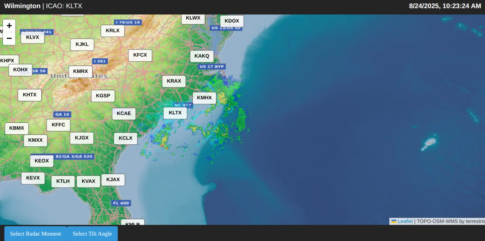

# LizardRadar
🌩️ NEXRAD Level II Radar Web Viewer

A high-performance browser-based radar visualization app that streams and parses NEXRAD Level II radar data in real time. This project implements a C++ NEXRAD binary parser compiled to WebAssembly (WASM), enabling direct decoding of raw radar files (reflectivity, velocity, spectrum width, etc.) in the browser without relying on heavy server-side processing.

✨ Features

Real-time data fetching from NOAA’s public NEXRAD Level II S3 bucket

Efficient binary parsing of AR2V/LDM blocks and Message Type 31 moments (REF, VEL, SW, etc.)

WebAssembly backend for near-native performance inside the browser

Dynamic radar tilt/scan selection with customizable visualization layers

Rasterization engine to generate 2D reflectivity/velocity maps up to 400 km range

Beam propagation corrections (effective Earth radius model, refractivity gradient)

🛠️ Tech Stack

C++17 + Emscripten → WebAssembly parser

JavaScript → Browser interface & data management

AWS S3 (NOAA NEXRAD Archive) → Real-time radar data source

🚀 Roadmap

Add dual-polarization moment parsing (ZDR, PHI, RHOHV)
Add region-based aliasing correction for velocity products
Interactive overlays: storm tracking, mesocyclone detection, rainfall accumulation
Fix map overlay issues using more sophisticated refractive index calculations

📸 Preview

  

